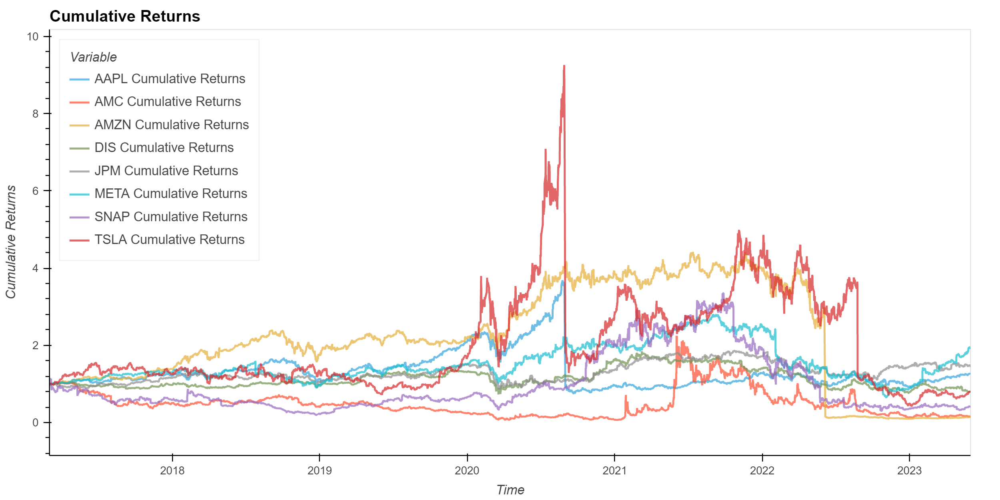
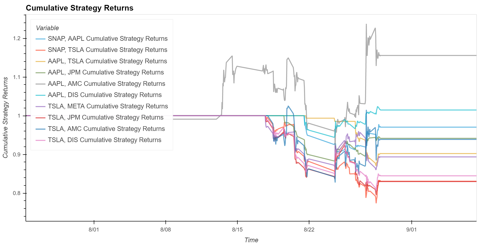
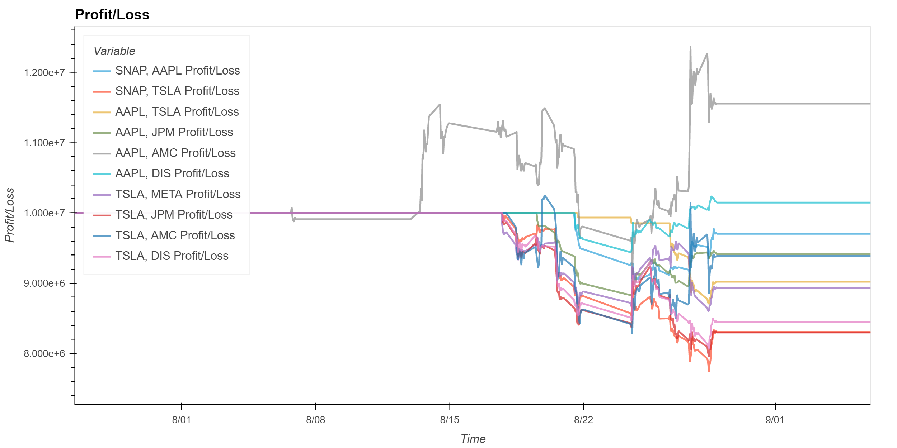

# Trading Algorithms

In this project, our goal is to develop and analyze trading algorithms for a diverse range of stocks, including well-known companies such as Apple (AAPL), Tesla (TSLA), Meta (META), JPMorgan Chase (JPM), Amazon (AMZN), AMC Entertainment (AMC), Snapchat (SNAP), and The Walt Disney Company (DIS). By employing two distinct trading strategies, Moving Average Crossover and Pairs Trading, we aim to conduct a comparison of their performance in terms of returns.

**Project Highlights**:

- Two Strategies, One Goal: Compare the Moving Average Crossover and Pairs Trading strategies to understand their performance in varying market conditions.

- Data-Driven Insights: Utilize historical stock price data to develop and backtest algorithmic trading strategies, gaining insights into their effectiveness.


Future Development: 
   - Refining profit calculations, incorporating risk management strategies, and optimizing algorithm execution.

   - Comparative Analysis: Evaluate the strategies based on metrics such as returns, volatility, and cumulative returns to determine their relative strengths.

   - Machine Learning Integration: Explore the integration of machine learning models to enhance strategy performance and signal accuracy.


---

## Technologies

The technologies used in this project include:

   * Python 3.7
   * JupyterLab 3.4.4
   * Pandas 1.3.5
   * Scikit-Learn 1.0.2 
   * Bokeh 2.4.3
  
---

## Installation Guide

Open your terminal and run the command:

```python
  pip install -r requirements.txt
```

---

## Usage

Clone the repository and open your preferred code editor, such as Visual Studio Code. 

Navigate to the project directory and locate the main.ipynb file.

As you navigate through the code, execute each cell in the notebook sequentially to load and prepare the data.

Explore the data by visualizing the closing prices, and returns.

Build the pairs trading strategy algorithm with a z-score threshold of 4.0.

Calculate and visualize the cumulative returns of the strategy, utilizing the zoom box to focus on the most intriguing segments of the plot for in-depth analysis.

Run the last block of code to backtest the algorithm with an initial investment. Plot the resulting profits/loss of the algorithm. 

Throughout the notebook, visualizations provide insights into the strategy's performance. Examples include cumulative returns plots and profit/loss plots.








## Contributors

* Ana Martelo (anafilipamartelo@gmail.com), ChristianYves, SNRice

---

## License

MIT
